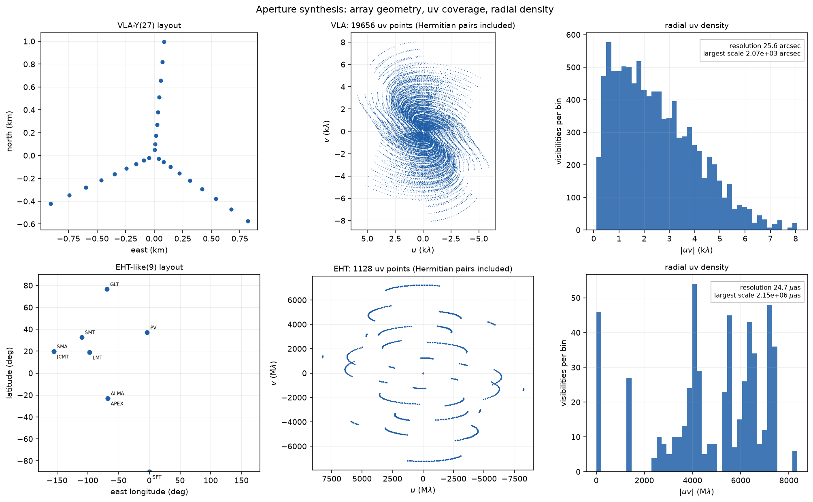
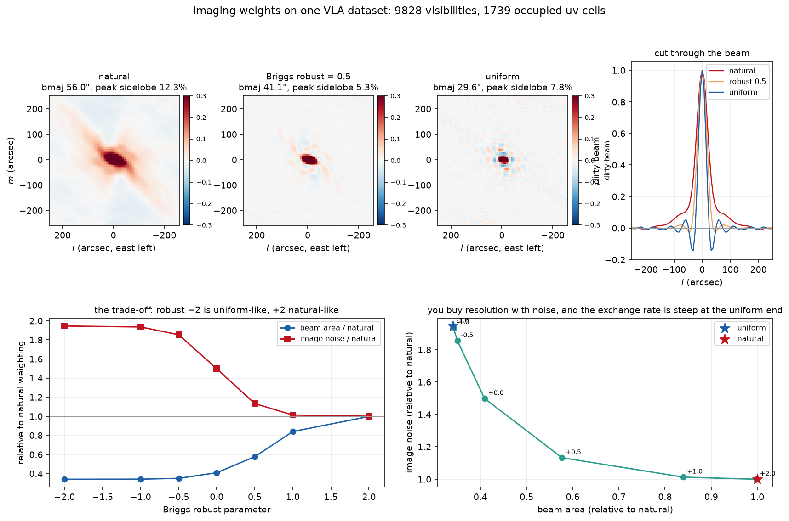
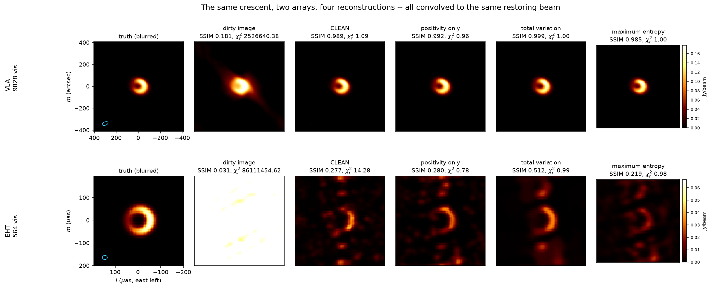
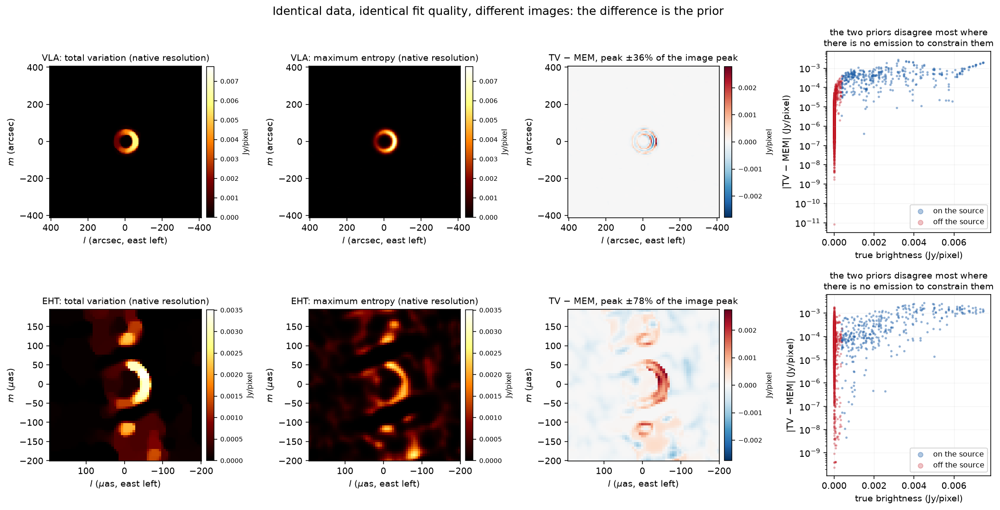
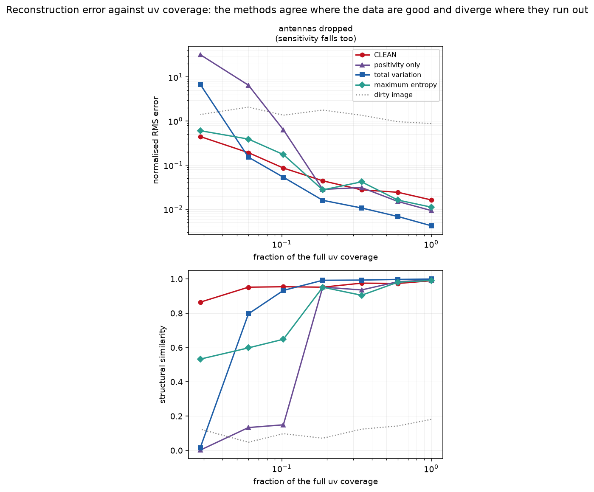
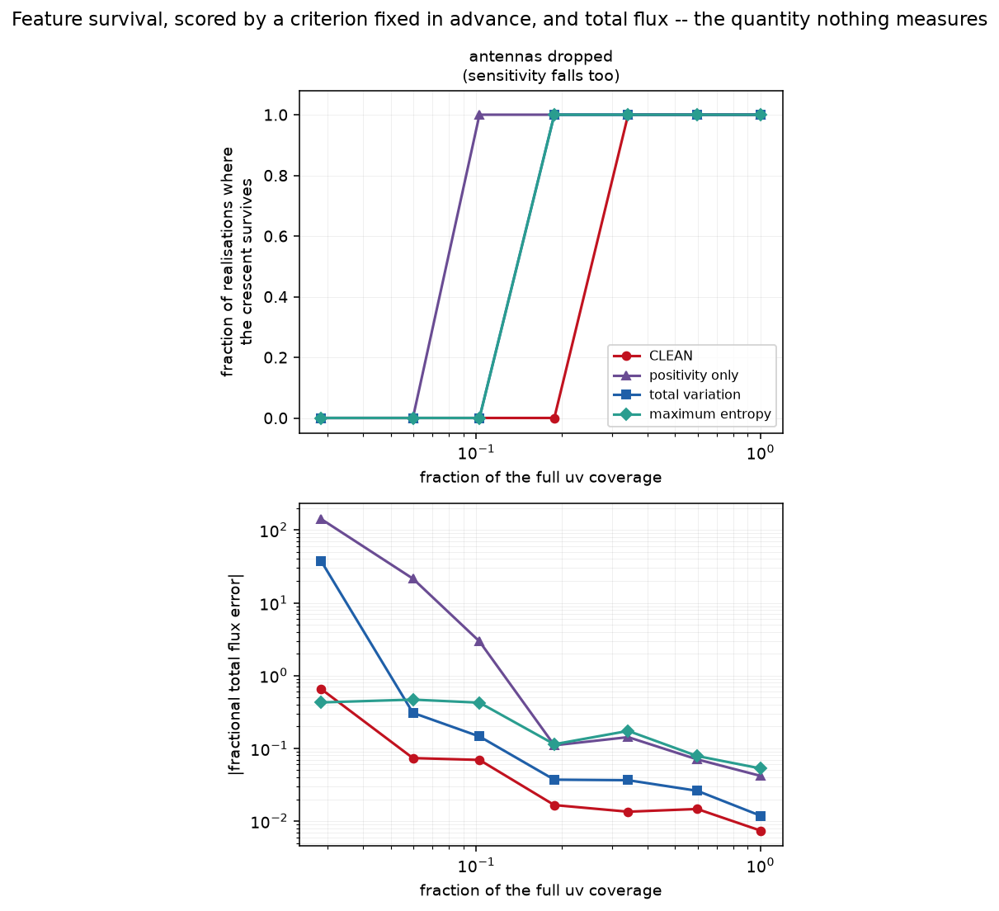
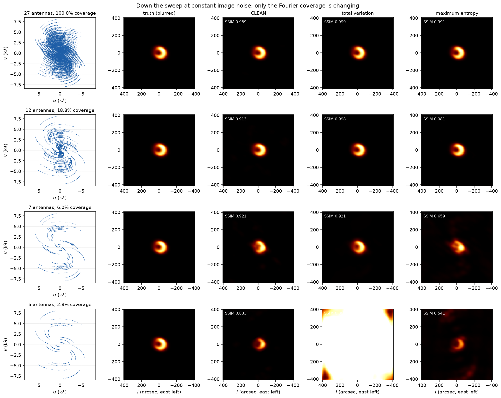
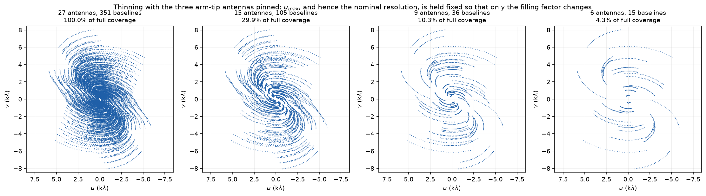
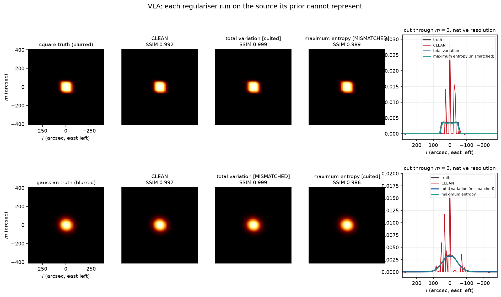
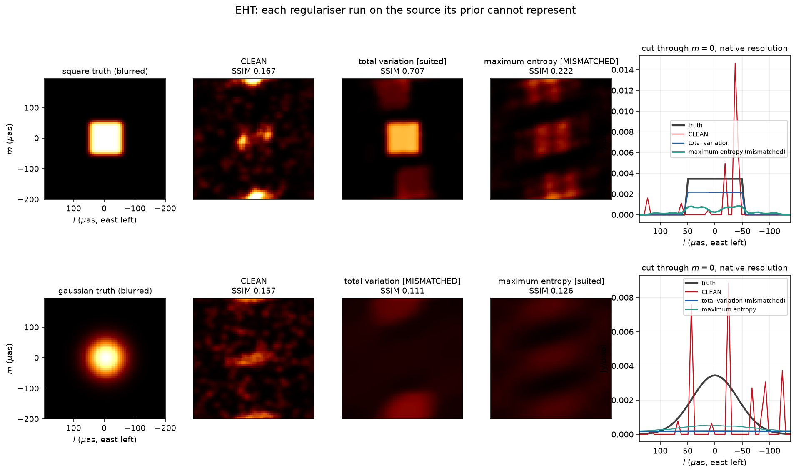

# Radio Interferometric Imaging From Scratch

An interferometer measures the Fourier transform of the sky at a scatter of
points and nowhere else. Reconstructing an image from that is an inverse problem
where the data constrain the answer only partially, and the prior does the rest
of the work. This project is a quantitative version of that claim: thin the uv
coverage from dense to sparse, run every reconstruction method at every level,
and measure how much of what you see was put there by the regulariser rather
than by the data.

Everything is written from scratch on numpy and scipy — the simulator, the
gridder, the degridder, CLEAN, FISTA, the total-variation prox, maximum entropy,
the HMC sampler, and SSIM. [`eht-imaging`](https://github.com/achael/eht-imaging)
does all of this properly and is cited here as prior art; the point of writing it
again was to be able to say exactly where each number comes from.

### Status

| | |
|---|---|
| Simulator, uv coverage, gridding, weighting | done |
| Dirty image / beam, CLEAN | done |
| Regularised inversion (FISTA + TV + MEM) | done |
| The honesty test | done, both arrays |
| The coverage sweep | **code done; figures on disk are from a quick smoke run, full run outstanding** |
| Bayesian uncertainty maps | **code complete, calibration outstanding** |
| Real archival data | **loaders written and tested, no dataset imaged** |

The two incomplete items are described in full in their own sections below,
including what was tried, what the diagnostics say, and what to do next.

The last two are marked honestly rather than quietly. The sampler is verified
against a posterior whose answer is known in closed form, but on the simulated
sparse-array problem its chains have not mixed and its credible intervals come
out overconfident, so **no uncertainty map is published here** — an uncertainty
map nobody can trust is worse than none. Details in
[the Bayesian section](#the-bayesian-layer-code-complete-calibration-outstanding).

Four results came out of this that I did not expect going in, and all four are
below: a gridding error that silently dominated the noise, a χ² normalisation
that had to be measured rather than derived, a **total-variation null space that
makes total flux unrecoverable**, and an honesty test that found nothing on the
well-covered array — which turned out to be the point.

---

## The one equation

For a small field of view, each pair of antennas at a given instant measures one
complex number,

$$V(u,v) = \iint I(l,m)\, e^{-2\pi i (ul + vm)}\, dl\, dm$$

a single sample of the 2D Fourier transform of the sky brightness $I(l,m)$, where
$(u,v)$ is the baseline vector projected perpendicular to the source direction
and measured in wavelengths. Everything follows:

- $N$ antennas give $N(N-1)/2$ baselines, so samples grow quadratically while
  antennas grow linearly.
- As the Earth rotates the projected baseline traces an ellipse in the uv plane,
  with axial ratio $\sin(\mathrm{dec})$. This is aperture synthesis, and it is the
  only reason a handful of antennas gives usable coverage.
- The longest baseline sets the resolution, the shortest sets the largest
  angular scale. **Nothing samples $(u,v) = (0,0)$, so total flux is
  unmeasured.** This turns out to matter more than it sounds — see
  [the flux result](#result-3-total-variation-cannot-determine-total-flux).
- The sky is real, so $V(-u,-v) = V^*(u,v)$. Every sample gives a second one
  free. This is enforced explicitly in `hermitian_augment` rather than left to
  the FFT to imply, which is what makes the gridded sampling function symmetric
  and the dirty beam exactly real.

With a sampling function $S(u,v)$ — a sum of delta functions at the measured
points — the dirty beam is $B = \mathcal{F}^{-1}[S]$ and the dirty image is
$I_D = \mathcal{F}^{-1}[S \cdot V]$, so by the convolution theorem

$$I_D = I * B .$$

Deconvolution is the entire problem. It is hard only because $S$ is sparse, which
gives $B$ sidelobes of 12% rather than the gentle skirt of a filled aperture.

---

## What is in here

```
src/
  array.py         antenna layouts (VLA-like Y, EHT-like global), uv track generation
  sky.py           ground-truth models: point, double, point+halo, crescent, square
  forward.py       sky -> visibilities, noise, gridding, weighting, both operators
  imaging.py       dirty image, dirty beam, clean-beam fit, restoration
  clean.py         Hogbom CLEAN
  regularised.py   FISTA, total variation, maximum entropy, L1
  bayesian.py      GP prior, HMC on log-intensity, convergence diagnostics
  metrics.py       RMSE, SSIM, dynamic range, feature survival, calibration
  realdata.py      UVFITS / measurement-set / npz loaders, closure phases
  plotting.py      figure conventions, fixed in one place
  experiments/     config, pipeline, and the six runnable experiments
tests/             121 tests
```

Run the experiments in this order; each writes figures to `figures/` and numbers
to `results/`.

```bash
python -m src.experiments.uv_coverage      # sanity check: look at the coverage first
python -m src.experiments.weighting        # natural / uniform / Briggs
python -m src.experiments.reconstructions  # the four methods, both arrays
python -m src.experiments.coverage_sweep   # the main experiment (~1 hour)
python -m src.experiments.honesty          # reconstructing against the prior
python -m src.experiments.bayesian_maps    # uncertainty maps (see the caveat below)
python -m src.experiments.run_all          # all of the above, in order
python -m pytest                           # 121 tests, ~2 minutes
```

`coverage_sweep.py --plot-only` rebuilds the figures from cached results.

---

## The two arrays

| | VLA-like | EHT-like |
|---|---|---|
| antennas | 27, three-arm Y | 9 stations on the globe |
| frequency | 1.4 GHz | 230 GHz |
| visibilities | 9 828 | 564 |
| resolution | 25.6″ | 24.7 µas |
| grid | 128² | 64² |
| occupied uv cells | 1 739 of 16 384 (10.6%) | 139 of 4 096 (3.4%) |
| peak psf sidelobe | 12.3% | **49.2%** |
| test crescent / field | 102″ of 818″ | 99 µas of 395 µas |

A 49% sidelobe is what "genuinely sparse" means: a single point source puts a
half-strength copy of itself somewhere else in the map, and deconvolution has to
decide which of the two is real. The VLA case is where the methods should agree,
which is what makes the EHT case interesting. VLA coverage is smooth concentric
ellipses; the EHT's is short disconnected arcs, because most baselines only have
the source above the horizon at both ends for part of the track.



**The field of view is itself a prior, and a strong one.** The EHT field is set to
four times the crescent diameter, because that is what an observer would choose.
Nothing in the data says the outer field is empty, so a wider field lets every
method scatter flux into it. Going from 4× to 8× made the EHT images visibly
worse — more spurious extended emission — while the SSIM scores went *up*, from
0.28 to 0.73 for CLEAN, because SSIM is a mean over pixels and empty background
agrees with empty background (see [the SSIM
caveat](#a-caveat-on-ssim-that-bit-me)). Both effects are larger than any
difference between the methods, which is worth knowing before reading much into
anyone's reconstruction, including these.

For consistency the VLA field should be 4× too; it is 8×, and I left it because
with 10.6% cell occupancy the VLA case is not field-limited. The EHT case is, so
that is where the choice was made carefully.

---

## Weighting: resolution costs noise



Same visibilities, imaged three ways. Natural weighting (inverse variance) gives
the best sensitivity and the worst beam, because the crowded short baselines
dominate the sum. Uniform weighting divides by the local uv density so every
occupied cell gets an equal say: the beam narrows and the noise rises. Briggs
robust is the family between them, and `robust = -2` and `+2` reproduce uniform
and natural exactly, which is the test that the implementation is right.

| | beam area | image noise | peak sidelobe |
|---|---|---|---|
| natural | 47.3 px | 2.60e-4 | 12.3% |
| Briggs robust 0 | 19.3 px | 3.89e-4 | 5.7% |
| uniform | 16.1 px | 5.05e-4 | 7.8% |

Natural to uniform: beam area ×0.34, noise ×1.95. The exchange rate is steep at
the uniform end — most of the resolution is bought by `robust = 0`, and pushing
further costs noise for almost nothing.

---

## The four reconstructions



All panels are convolved to the same restoring beam, because otherwise the
comparison measures units as much as astronomy: CLEAN's model is a list of delta
functions in Jy/pixel and its restored image is in Jy/beam, while TV and MEM
produce Jy/pixel images at whatever resolution the data and the prior support.
Every method is scored twice — at native resolution and at a common resolution —
and both are in `results/`.

VLA, crescent, per-visibility SNR 20:

| method | $\chi^2_r$ | SSIM | nRMSE | dynamic range | flux error |
|---|---|---|---|---|---|
| dirty image | — | 0.181 | 0.879 | 8 | — |
| CLEAN | 1.09 | 0.989 | 0.0166 | 680 | −1.1% |
| positivity only | 0.96 | 0.992 | 0.0104 | 1794 | +4.3% |
| total variation | 1.00 | **0.999** | **0.0043** | 1257 | +1.1% |
| maximum entropy | 1.00 | 0.985 | 0.0143 | 1210 | +6.7% |

EHT, same crescent, 564 visibilities:

| method | $\chi^2_r$ | SSIM | nRMSE |
|---|---|---|---|
| CLEAN | 14.3 | 0.277 | 0.720 |
| positivity only | 0.78 | 0.280 | 0.739 |
| total variation | 0.99 | **0.513** | **0.664** |
| maximum entropy | 0.99 | 0.219 | 0.817 |

Two things to note. CLEAN cannot reach $\chi^2_r = 1$ on the EHT data at all — it
stops at 14, because a delta-function model plus a 3σ stopping threshold cannot
represent this source. And positivity alone reaches $\chi^2_r = 0.78$, i.e. it
*over*-fits: 282 independent complex visibilities against 4 096 pixels is
massively underdetermined, so an unregularised solve fits the noise, and which of
the many equally-good answers it lands on depends on the path the optimiser took.
That path-dependence is worth naming — it is an implicit prior, exactly like
CLEAN's, and the only difference is that nobody wrote it down.

---

## Choosing λ without looking at the truth

A regularised image with a hand-tuned λ proves nothing, because λ can be tuned
until the answer looks like whatever you expected. Every regularised solve here
picks λ by bisection so that the solution fits the data to reduced $\chi^2 = 1$ —
as well as the noise allows and no better. That is defensible, truth-free, and
the same rule at every point of the sweep.

Two things had to be fixed before that was meaningful, and they are the most
useful engineering lessons in the project.

### The χ² normalisation had to be measured, not derived

A complex residual per measurement is two real numbers, so the divisor is
$2 N$ — but the Hermitian partners are perfectly correlated *and* contribute
twice, and the two factors of two cancel. Rather than trust that argument, there
is a test that generates noise-only data and checks that a zero model scores
$\chi^2_r = 1$. The same class of error, uncorrected, made my first
image-plane noise estimate low by exactly $\sqrt{2}$ — which would have set
CLEAN's stopping threshold too low and let it chew into the noise.

### Nearest-neighbour gridding was not good enough

The obvious operator grids the data to uv cells and evaluates the model at cell
centres. The phase error is $2\pi (du/2) l$, so it grows with distance from the
phase centre. For a source a couple of resolution elements off centre it reaches
**5.5% of the visibility amplitude — about 1.5× the thermal noise at SNR 20.**
That is a systematic in the forward model, and it made the truth itself score
$\chi^2_r = 3.5$: "fit to $\chi^2 = 1$" would have been fitting the gridding
error.

So there are two operators. `MeasurementOperator` is the gridded one, used for
dirty images and CLEAN, where gridding is what the algorithm *is*.
`DegridOperator` is a proper NUFFT-style operator — deapodise, zero-pad, FFT,
interpolate with a Kaiser–Bessel kernel — with model error **1.6e-4** relative,
300× better, at which point the truth scores $\chi^2_r = 0.996$ and the λ choice
means something. Both have exact adjoints.

**Write the adjoint test first.** A wrong adjoint does not make the optimiser
diverge; it makes it converge smoothly and confidently to the wrong answer with a
plausible-looking residual. Both operators pass
$\langle Ax, y\rangle = \langle x, A^Ty\rangle$ to 1e-10, and so does the
gradient/divergence pair inside the TV prox, which is the same bug one level
down.

---

## Result 1: the prior made visible



Total variation and maximum entropy, given **identical data**, both fitting it to
the same reduced $\chi^2 \approx 1$, produce visibly different images. Where the
difference is small the data have pinned the answer down; where it is large they
have not, and what fills the gap is the regulariser.

The difference map is the figure to read. On the VLA it peaks at 36% of the image
peak and is confined to the *edges of the ring* — the two priors agree about
where the emission is and disagree only about how sharply it falls off. On the
EHT it reaches 78% and is spread across the whole field, including regions with
no true emission at all.

The right-hand panels quantify that. In absolute Jy/pixel the two priors
necessarily differ most where the source is brightest — that is just scale, and
the first version of this panel said so while being captioned as if it said the
opposite. The informative number is the *share* of the total disagreement that
falls on empty sky, which is what separates a well-constrained reconstruction
from one where the prior is inventing structure.

This is the point of the project, and it is worth being concrete about *why* they
differ. TV penalises the total amount of change, which is minimised by
piecewise-flat images, so it preserves edges and staircases gradients. Maximum
entropy, $R(I) = \sum I_j \log(I_j/m_j)$, is minimised by images matching the
prior image $m$, so it produces smooth positive images and cannot make a hard
edge however good the data are.

---

## Result 2: CLEAN throws away the resolution it earned

CLEAN's implicit prior is that the sky is a sum of delta functions. It is not a
regulariser you can write down or tune, but it is a prior all the same, and it is
why CLEAN handles extended emission badly — a smooth ring gets decomposed into a
speckle of points that only looks smooth again after restoration. Extended
emission also needs thousands of iterations, not hundreds, because each component
only removes `gain` times its own peak.

The restoring step is a real loss, not a formality. With two point sources one
nominal resolution element apart, CLEAN's **component list separates them** —
genuine super-resolution, because the deconvolution used the point-source
assumption — and convolving with the restoring beam **merges them back into a
single blob.** There is a test that asserts exactly this (two peaks in the model,
one in the restored image). The information was there and the last step discarded
it. Nobody can tell you how much of that sharpness to trust, which is the
standard objection to the CLEAN restored image.

---

## Result 3: total variation cannot determine total flux

This one surprised me, and it is the sharpest illustration of the project's
thesis that I found.

$\mathrm{TV}(I + c) = \mathrm{TV}(I)$ for any constant $c$: **a flat pedestal
costs total variation nothing.** Constants are in TV's null space, so TV cannot
distinguish images differing by a constant, and it falls to the data to do so.
The data can only do that through the zero-spacing visibility — the total flux —
and no baseline measures it.

In practice the shortest baselines land *inside* the origin uv cell and stand in
for it, but only while $\min|uv| < du/2 = 1/(2 \cdot \mathrm{npix} \cdot
\mathrm{cell})$. The coverage sweep walks straight across that threshold:

| antennas | min\|uv\| | du/2 | origin cell | sum(psf) |
|---|---|---|---|---|
| 27 | 99 λ | 126 λ | occupied | 30.0 |
| 12 | 131 λ | 126 λ | occupied | 8.9 |
| 7 | 301 λ | 126 λ | **empty** | 0 (exactly) |
| 5 | 546 λ | 126 λ | **empty** | 0 (exactly) |

Below the threshold `sum(psf)` is exactly zero and the total flux is constrained
by neither the data nor the penalty. Recovered total flux, truth 1.0, λ chosen by
the same χ²=1 rule in every case:

| antennas | pure TV | TV + flux penalty | MEM |
|---|---|---|---|
| 27 | 1.009 | 1.008 | 1.066 |
| 7 | 1.147 | 1.081 | 1.413 |
| 5 | **6.044** | 1.165 | 1.416 |

Pure TV invents a flat pedestal of **six times the true total flux**, and its
nRMSE goes to 0.78; subtracting the median pedestal drops that to 0.43,
confirming that most of the error is in that one unconstrained mode.

The factor of six is not a universal constant. The unconstrained mode is a
pedestal over the *whole field*, so the invented flux scales with the number of
pixels: on a 64² grid the same array and the same solver give 1.3× rather than
6×. What is universal is the mechanism — the mode exists, nothing constrains it,
and how much damage it does depends on how much empty field you gave it. This is
the same lesson as the field-of-view note above, arriving from a different
direction.

Maximum entropy does not have this problem — its penalty grows with brightness,
so it is not blind to a pedestal — and neither is CLEAN's point-source prior. The
flux degeneracy is a property of the *prior*, not of the data.

The fix is one line: add a small flux penalty, $\lambda(\mathrm{TV} + \eta\sum
I)$ with $\eta = 0.02$, which picks the minimum-flux image among those TV cannot
tell apart. With positivity the primal step in the inner solve is just a shift.
Note from the table that it changes nothing at 27 antennas (1.008 vs 1.009) and
rescues the sparse end (1.165 vs 6.044, nRMSE 0.33 vs 0.78) — it only acts on the
mode the data left free, which is what a well-chosen regulariser should do. It is
still a prior choice and has to be declared as one: "assume the least flux
consistent with the data" is an assumption, not a measurement. Pure TV is kept in
the sweep so the failure stays visible rather than being quietly patched.

---

## Result 4: the coverage sweep







Fix the crescent. Thin the coverage. Run everything at every level. The three arm
tips are pinned throughout, so the plane empties out without $u_{max}$ changing —
otherwise the sweep would be measuring a loss of resolution as well as a loss of
coverage, and there would be no way to tell which caused what.

Three sweeps, because one alone would be ambiguous:

- **`thin`** — drop antennas, with the three arm tips pinned so $u_{max}$ and
  hence the nominal resolution stay fixed. Per-visibility noise held constant, so
  total sensitivity falls too, which is what really happens when you lose
  antennas.
- **`thin_fixed_sensitivity`** — the same thinning, with $\sigma \propto
  \sqrt{n_{vis}}$ so the thermal noise in the image is constant along the sweep.
  **This is the sweep that isolates coverage from sensitivity.** Any degradation
  here is missing Fourier information and nothing else.
- **`track`** — keep all 27 antennas and shorten the observation instead, so
  coverage thins along the uv ellipses rather than by losing whole baselines.

Every level shares the imaging grid and the restoring beam of the *full* array,
so all the numbers are on one yardstick; letting each thinned array fit its own
beam would mix a resolution change into what is supposed to be a coverage change.
Feature survival is scored by a criterion fixed in advance in `metrics.py`: the
crescent survives only if the central hole is below half the ring brightness, the
ring peaks within half a width of the true radius, **and** the first azimuthal
harmonic has amplitude ≥ 0.2 with its position angle within 30°. The amplitude
clause matters — without it a symmetric reconstruction passes whenever its
arbitrary centroid angle happens to land close, which is a coin toss rather than
a measurement.

> **Numbers outstanding.** The figures above are rendered from a `--quick`
> smoke run: one sweep, one seed, small iteration budgets, and without the
> `tv_flux` method. They show the expected shape — the methods agree above
> roughly 20% coverage and fan out below it, with pure TV collapsing at the
> sparse end for the reason in Result 3 — but they are not the publishable
> version. The full three-sweep, two-seed run takes about 90 minutes:
>
> ```bash
> python -u -m src.experiments.coverage_sweep
> python -m src.experiments.coverage_sweep --plot-only
> ```
>
> Quick-run SSIM at the sparse end (5 antennas, 2.8% coverage), for orientation
> only: CLEAN 0.86, MEM 0.53, pure TV 0.015, positivity-only 0.002. The two
> collapses are the flux degeneracy of Result 3, not a solver failure.

### A caveat on SSIM that bit me

SSIM is a mean over pixels, and empty background agrees perfectly with empty
background, so padding the *same* pair of images with blank sky drives the score
towards 1. The controlled version: take one blurred crescent and its truth, and
pad both with empty sky. SSIM goes **0.79 → 0.95 → 0.98** at 64², 128² and 192²
pixels, for images that have not otherwise changed at all. There is a test
asserting exactly this.

That is what I ran into when the EHT grid went from 128² to 64²: the SSIM scores
dropped from 0.73 to 0.28 while the images got visibly *better*. Those two runs
differ in more than the field, so that pair is corroboration rather than a
controlled measurement — but it is the reason the controlled test exists. SSIM
values are only comparable at a fixed field size, which is why every comparison
here fixes the grid before varying anything else, and why the sweep's SSIM values
should be read as a curve shape rather than as absolute quality.

---

## Result 5: the honesty test, and why the first version of it was misleading




Every paper in this area shows results on the kind of source its method suits, so
this experiment does the opposite: a **sharp-edged square** under **maximum
entropy**, whose penalty is minimised by smooth images and which therefore should
not be able to produce a hard edge; and a **smooth broad Gaussian** under
**total variation**, which prefers piecewise-flat images and should staircase it.
Each truth is also run through the regulariser that does suit it, and through
CLEAN, so a failure can be attributed to the prior rather than to the data or the
solver. Two criteria are fixed in advance — edge sharpness across the true
boundary, and a staircase index measuring how concentrated the brightness
histogram is onto a few levels — and both are read against the truth's own value.

SSIM of the suited prior against the mismatched one, same data, both fitting to
χ² ≈ 1:

| array | truth | suited | mismatched | change |
|---|---|---|---|---|
| VLA | square | TV **0.9993** | MEM 0.9891 | −1.0% |
| VLA | gaussian | MEM 0.9861 | TV **0.9990** | **+1.3%** |
| EHT | square | TV **0.7074** | MEM 0.2225 | **−68.6%** |
| EHT | gaussian | MEM **0.1260** | TV 0.1111 | −11.8% |

**On the well-covered VLA array the predicted failure does not happen at all.**
On the smooth Gaussian the *mismatched* prior actually wins, by 1.3%, and the two
staircase indices are identical to three decimals (0.230 each, against the
truth's 0.226) — total variation simply does not staircase a smooth source when
the data are good. That is not a null result; it is the thesis restated. λ is
chosen so the solution fits the data to χ² = 1, and with 10.6% cell occupancy the
data leave the penalty almost nothing to do. **A prior can only impose its
character where the data are silent.**

On the sparse EHT array the same pairing is catastrophic — the mismatched prior
loses 69% of its SSIM — and the shape criteria show each regulariser failing in
exactly its predicted direction:

| criterion | truth | TV | MEM |
|---|---|---|---|
| VLA, square: edge sharpness | 0.351 | 0.326 | 0.274 |
| EHT, square: edge sharpness | 0.351 | 0.291 | **0.171** |
| VLA, gaussian: staircase index | 0.226 | 0.230 | 0.230 |
| EHT, gaussian: staircase index | 0.226 | **0.459** | **0.117** |

The last row is the textbook prediction landing exactly: on sparse data TV
staircases the smooth Gaussian into plateaux (index twice the truth's) while
maximum entropy smooths it out (index half the truth's). Neither can help it —
that is what their penalties are.

One caveat on that row, because the SSIM gap there is small and it would be easy
to over-read. On the EHT the Gaussian is barely reconstructed by *anybody*: 0.126
and 0.111 are both bad. A broad smooth source has essentially all of its Fourier
power at short baselines, and this array has almost none — its radial uv density
is empty between about 200 and 2400 Mλ. So that case is dominated by missing
coverage rather than by the choice of prior, and the honest reading is that the
shape criteria still show the characteristic failure directions while the overall
scores show that neither prior can rescue information the array never collected.
The clean demonstration of prior mismatch is the EHT square row, where one method
works and the other does not.

Two things follow that I would not have got from the dense case alone. First, the
purpose-built shape criteria detect the prior's fingerprint on the VLA square
(edge 0.326 vs 0.274) where SSIM sees a 1% difference and effectively nothing;
a generic metric is the wrong instrument for asking whether a specific feature
survived. Second, the VLA row is kept in the figure rather than dropped, because
"the honesty test found nothing here" is itself the finding — reporting only the
sparse numbers would overstate how much the choice of regulariser matters in
general, and reporting only the dense ones would understate it badly.

I also had to fix the experiment before it measured anything. The first version
computed edge sharpness on the *common-resolution* image — and convolving with
the restoring beam removes the edge by construction, so TV and MEM both scored
0.125 and the metric was blind to precisely the effect it existed to detect. Both
shape criteria are now measured on the native model. The lesson generalises: a
metric evaluated after a smoothing step cannot see sharpness, and it will not
tell you it has stopped working.

CLEAN, for the record, cannot fit the sparse data at all here: χ²ᵣ of 23 on the
square and 20 on the Gaussian, against ~1 for both regularisers. A sum of delta
functions is the wrong model for a flat-topped source, and no amount of iterating
fixes that.

---

## The Bayesian layer: code complete, calibration outstanding

The deliverable here is the **uncertainty map**, not the mean image — being able
to say that the ring is solid while some secondary feature is not is the one
thing CLEAN cannot give you at all.

The model samples the log brightness $\theta = \log I$, which enforces positivity
with no boundary to get stuck against, under a stationary Gaussian process prior
with a Whittle–Matérn spectrum. Because that prior is stationary it is diagonal in
Fourier space, so drawing from it, applying its inverse and computing its log
density are all FFTs. The sampler is hand-written HMC with the **mass matrix set
to the prior precision**, $M = C^{-1}$, which makes the prior part of the
Hamiltonian flow an exact rotation and stops the efficiency collapsing as the grid
is refined; with $M = I$ it is unusable at 4 096 dimensions. Step size is adapted
by dual averaging.

Positivity is what makes the uncertainty map interesting, and that is worth
stating. Put a Gaussian prior directly on $I$ and drop positivity, and the
posterior is exactly Gaussian and — for a stationary prior and a gridded operator
— diagonal in Fourier space, so every pixel gets *identical* variance. A flat
uncertainty map is arithmetic, not information. The structure comes from the
non-Gaussianity.

**Status: the sampler is verified correct; the posterior is not yet trustworthy.**

- Verified: with no data the posterior is the prior, and HMC reproduces the
  prior's mean (−3.005 vs −3.0), marginal standard deviation (1.496 vs 1.5) and
  spatial covariance function at several lags. The gradient matches finite
  differences, and the mass matrix and kinetic energy are checked to be
  consistent operators ($E[K] = \dim/2$). 16 tests pass, including split-R̂ and
  ESS diagnostics that detect drifting and disagreeing chains.
- **Not delivered:** on the simulated EHT-like crescent (4 096 parameters, 282
  visibilities) the chain has not equilibrated — the potential drifts upward
  throughout sampling instead of settling, and credible-interval coverage came out
  at 0.11 on bright pixels against a nominal 0.683, i.e. badly overconfident. An
  uncertainty map nobody can trust is worse than no uncertainty map, so no
  uncertainty map is published here.

This is a mixing and prior-hyperparameter problem, not a correctness one. The
likely culprits, in order: the step size collapses to ~3e-3 because the `exp`
reparametrisation makes the likelihood curvature vary enormously between bright
and faint pixels, which argues for a mass matrix that also carries a pixel-space
diagonal term; the prior's correlation length (4 px) is comparable to the ring
width, so the prior may be fighting the data; and the prior mean brightness is set
from "total flux spread uniformly", which is much flatter than the truth. The
calibration check is implemented and will be the acceptance criterion:
`credible_interval_coverage` against nominal at several σ, on-source and
off-source separately.

---

## Real data: wired up, not yet run

`realdata.py` reads UVFITS (the EHT release format, needs `astropy`), CASA
measurement sets (needs `python-casacore` or `casatools`), and a
dependency-free `.npz` interchange format. The loaders are tested — including
against a UVFITS file the test suite writes itself with the same random-groups
layout and the same units, which catches the mistakes that actually happen: the
seconds-versus-wavelengths conversion, the frequency axis, the Stokes collapse,
the flag handling. The full pipeline is tested end to end on data that went out to
disk and came back.

**No archival dataset has been imaged.** That needs a download and an optional
dependency, and pretending otherwise would be the opposite of the point of the
honesty test. To do it:

```bash
pip install astropy
python -m src.experiments.real_data --uvfits path/to/eht_m87.uvfits
```

Three things real data brings that the simulator does not, all handled:

- **Channels.** $(u,v)$ is in wavelengths, so it differs per channel. Averaging
  before gridding smears the longest baselines radially, so channels are expanded
  by default and the shortcut announces itself when used.
- **Weights that are not inverse variances.** Archive weights are often in
  arbitrary units. A σ wrong by a factor of three makes $\chi^2_r$ wrong by nine,
  and then every χ²-based decision is wrong.
  `rescale_weights_from_scatter` re-derives σ from the scatter of the data in
  annuli of $|uv|$.
- **Residual calibration errors.** This is the real obstacle. Station gains
  drift, so the measured visibilities are not the sky's transform times a known
  constant. The standard remedy, self-calibration, alternates imaging with solving
  for per-station gains — a whole second project, and deliberately not attempted.
  `closure_phase` is provided because closure quantities are the part of the data
  that station gains cannot corrupt (there is a test that corrupts every station
  with an arbitrary phase and asserts the closure phase does not move), which is
  how you tell a calibration problem from an imaging problem. Expect a
  reconstruction from real data to be *worse* than the published one.

---

## Tests that catch real bugs

```bash
python -m pytest            # 118 passed, 3 skipped (astropy-dependent)
```

| test | assertion |
|---|---|
| adjoint | $\langle Ax,y\rangle = \langle x,A^Ty\rangle$ to 1e-10, both operators, all weighting schemes |
| grad/div adjoint | the same identity inside the TV prox, to 1e-12 |
| round trip | full uv coverage, no noise, dirty image equals truth to 1e-12 |
| point source | dirty image of a delta function equals the dirty beam *exactly* (0.0 error) |
| Hermitian | dirty image imaginary part below 1e-12 of the real part |
| Parseval | energy consistent between domains |
| flux | $\sum I_D = \sum B \cdot F_{model} + \sum I_{res}$ exactly, and the residual sum is invariant when the origin cell is emptied |
| bookkeeping | `dirty == components * psf + residual` to machine precision |
| positivity | every regularised output is non-negative |
| χ² normalisation | a zero model on noise-only data scores $\chi^2_r = 1$ |
| image noise | predicted dirty-image noise matches a Monte Carlo realisation |
| TV prox | matches an independent optimiser on the objective it claims to minimise |
| sampler | with no data, HMC reproduces the prior's mean, variance and covariance function |

The ones that earned their keep: the point-source test (it fails for a half-pixel
offset anywhere in the chain, and passing at exactly 0.0 means the gridding,
weighting, FFT centring and both normalisations all agree); the χ² normalisation
test (it found the factor of two); and the noise test (it found the $\sqrt{2}$).

---

## What I would do next, in order

1. **Fix the HMC calibration** and publish the uncertainty map with a coverage
   curve as its acceptance criterion. A pixel-space diagonal term in the mass
   matrix is the first thing to try.
2. **Run the sweep on the EHT array**, where the divergence between priors is
   largest and the sweep therefore says the most.
3. **Image a real EHT or VLA dataset**, with a modest goal: produce a recognisable
   image with this code and compare against the published one. Not beat it.
4. **Self-calibration**, which is the thing standing between step 3 and a fair
   comparison.

## Conventions, fixed once

- Images are `(npix, npix)`; axis 0 is $m$ (north), axis 1 is $l$ (east); phase
  centre at `[npix//2, npix//2]`. Figures are drawn east-left, north-up.
- The FFT pair is unitary and centred, so $\mathcal{F}^H = \mathcal{F}^{-1}$
  exactly, which is what makes the operator adjoints free and exact. The physical
  $\mathrm{npix}$ factor is carried explicitly rather than hidden in the FFT.
- Image sizes are 128² (VLA) and 64² (EHT). Every algorithm here scales badly and
  nothing about the science needs more pixels.

## Prior art

- Thompson, Moran & Swenson, *Interferometry and Synthesis in Radio Astronomy* —
  the uvw projection and the weighting schemes.
- Högbom (1974) — CLEAN. Briggs (1995) — robust weighting.
- Beck & Teboulle (2009) — FISTA and its backtracking rule.
  O'Donoghue & Candès (2015) — adaptive restart.
- Chambolle & Pock (2011) — the primal-dual algorithm used for the TV prox.
- Wang et al. (2004) — SSIM.
- Hoffman & Gelman (2014) — dual averaging. Beskos et al. (2011) — HMC for
  inverse problems, which is where the prior-precision mass matrix comes from.
- [`eht-imaging`](https://github.com/achael/eht-imaging) — Chael et al., and
  the EHT Collaboration's M87 papers.
